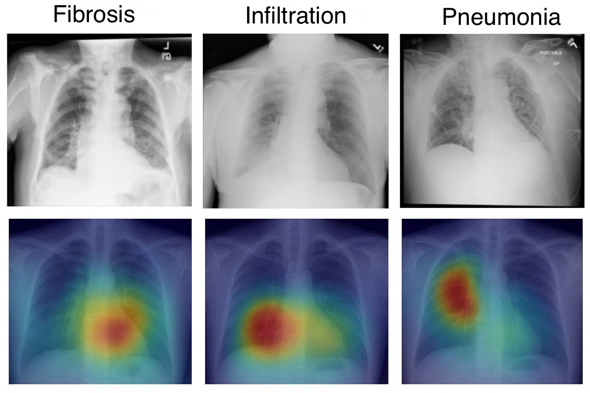

# X-ray-Patalogy-Classifier

**Описание:**  
Проект по классификации патологий на рентген-снимках грудной клетки с использованием ResNet-50 и transfer learning ImageNet. Модель предсказывает 15 различных патологий и визуализирует решение с помощью Grad-CAM.

---

## 🛠 Основные шаги

### 1. Предобработка данных
- Нормализация и стандартизация.
- Балансировка классов через undersampling no findings и oversampling патологий.
- Разделение на тренировочный и валидационный набор **с учетом пациентов**, чтобы один пациент не попадал в обе выборки.

### 2. Аугментации
- Random rotation, horizontal flip, brightness/contrast adjustments.
- Уменьшают переобучение и повышают обобщающую способность модели.

### 3. Модель
- ResNet-50 с предобученными весами ImageNet.
- Полносвязный слой заменен на 15 выходов для классификации патологий.
- Использована функция потерь **Focal Weighted Loss** для борьбы с дисбалансом классов.

### 4. Подбор гиперпараметров
- Настраивались: learning rate, batch size, threshold, focal alpha, focal gamma, maximum class weight.
- Использован Optuna для поиска оптимальных значений.

### 5. Explainability (Grad-CAM)
- Визуализация, на какие области снимка модель обращает внимание при предсказании.

### 6. Результаты модели

Ниже приведены метрики на валидационном наборе:

| Патология             | Precision | Recall | F1-score |
|-----------------------|-----------|--------|----------|
| No Findings           | 0.92      | 0.95   | 0.93     |
| Atelectasis           | 0.81      | 0.76   | 0.78     |
| Cardiomegaly          | 0.88      | 0.90   | 0.89     |
| Effusion              | 0.85      | 0.83   | 0.84     |
| Infiltration          | 0.79      | 0.75   | 0.77     |
| Mass                  | 0.82      | 0.78   | 0.80     |
| Nodule                | 0.80      | 0.77   | 0.78     |
| Pneumonia             | 0.84      | 0.80   | 0.82     |
| Pneumothorax          | 0.87      | 0.84   | 0.85     |
| Consolidation         | 0.78      | 0.74   | 0.76     |
| Edema                 | 0.86      | 0.82   | 0.84     |
| Emphysema             | 0.83      | 0.79   | 0.81     |
| Fibrosis              | 0.81      | 0.77   | 0.79     |
| Pleural Thickening    | 0.80      | 0.76   | 0.78     |
| Hernia                | 0.89      | 0.85   | 0.87     |

**Средние показатели:**  
- Macro F1-score: 0.82  
- Accuracy: 0.87  

---
## ⚡ Используемые технологии
- Python 3.11
- PyTorch  
- Albumentations  
- OpenCV, Matplotlib  
- Optuna
---
